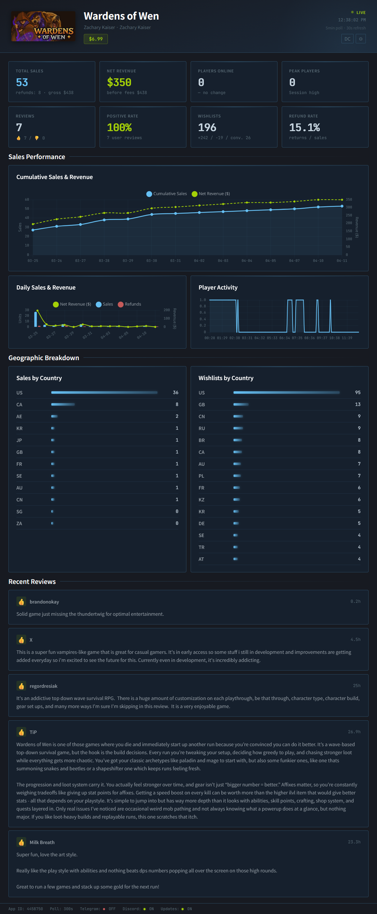
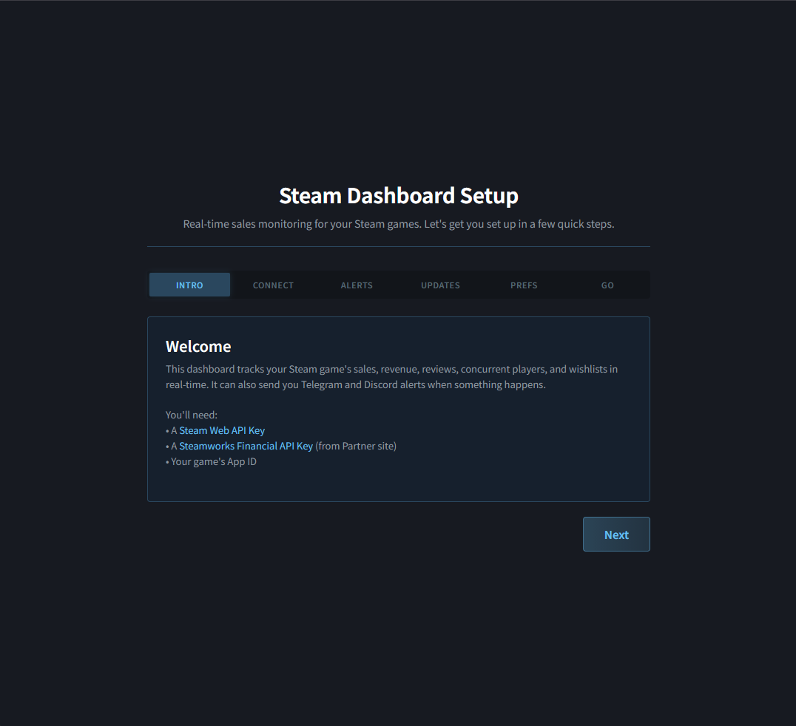
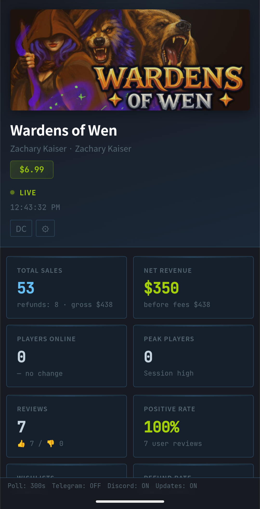
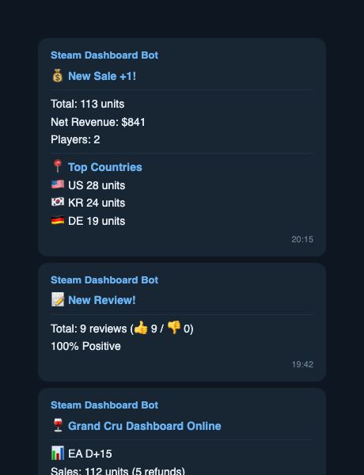
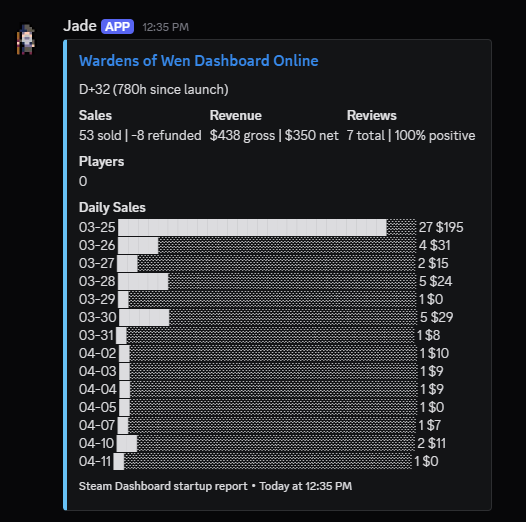
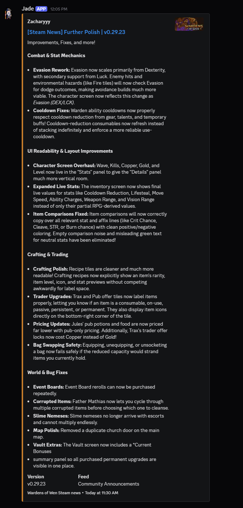
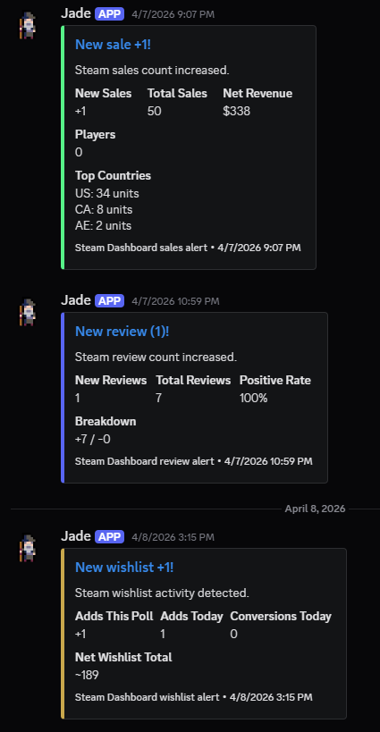

# Steam Dashboard

**Real-time Steam sales monitoring for indie game developers. Single Python file, zero dependencies.**

[](https://www.python.org/downloads/)
[](LICENSE)
[](https://github.com/sponsors/STRHercules)



## Why This Exists

> After launching my game on Steam, I caught myself refreshing the Steamworks sales page twelve times a day. So I built this.

Steam Dashboard is a self-hosted monitoring tool that pulls your sales, wishlists, reviews, and player counts into a single real-time view — with Telegram alerts so you never have to refresh again.

## Features

- **Real-time sales & revenue tracking** — sales, revenue, refunds, all in one place
- **Telegram instant alerts** — new sale, new review, player spike
- **Country-level breakdown** — sales and wishlist data by region
- **Concurrent player monitoring** — trend charts with historical data
- **Wishlist tracking** — adds, removes, and conversion rates
- **Web-based setup wizard** — no config files to edit, ever
- **Multi-game support** — monitor all your titles from one dashboard
- **Korean & English UI** — auto-detects browser language
- **Mobile-friendly** — responsive design, check sales from your phone
- **Single Python file** — no pip install, no virtualenv, no Docker
- **100% self-hosted** — your data never leaves your server

## Quick Start

```bash
# 1. Clone
git clone https://github.com/chihyunn/steam-dashboard.git
cd steam-dashboard

# 2. Run
python3 dashboard.py

# 3. Open browser
# → http://localhost:8081
# → Setup wizard guides you through everything
```

That's it. No `requirements.txt`, no `.env` files, no database setup.

## Screenshots

| Setup Wizard | Dashboard |
|:---:|:---:|
|  |  |

| Mobile View | Telegram Alerts |
|:---:|:---:|
|  |  |

## Getting Your API Keys

The setup wizard will ask for two keys. Here's where to find them.

### Steam Web API Key (Public Data)

This key accesses public data: player counts, reviews, app details.

1. Go to [steamcommunity.com/dev/apikey](https://steamcommunity.com/dev/apikey)
2. Enter any domain name (e.g., `localhost`)
3. Copy the key

### Steam Financial API Key (Partner Data)

This is the one that's hard to find. It accesses sales, revenue, and wishlist data.

1. Log into [partner.steamgames.com](https://partner.steamgames.com)
2. Click **Users & Permissions** in the top menu
3. Click **Manage Groups**
4. Click your publisher/developer group name
5. In the sidebar, click **Web API Key**
6. If no key exists, click **Create** or **Generate New Web API Key**
7. Copy the key — it starts with a long hex string

> **Note:** You need "View Financial Info" permission in your Steamworks group to access this key. If you don't see the Web API Key option, ask your group admin for access.

## Discord Setup (Optional)

Get notified in your Discord server when someone buys your game, leaves a review, or when your game hits a milestone. Plus, access a specialized Discord-themed dashboard!

### Step 1: Create a Webhook

To receive alerts and daily summaries in Discord, you'll need a webhook.
1. Right-click the Discord channel you want notifications in and select **Edit Channel**.
2. Go to **Integrations** > **Webhooks** and click **New Webhook**.
3. Give it a name (e.g., "Steam Alerts") and copy the **Webhook URL**.
4. You can create separate webhooks for alerts and daily announcements, or use the same URL for both.

### Step 2: Configure in Settings

1. Open your Steam Dashboard settings (`http://localhost:8081/settings`).
2. Paste your Webhook URLs into the Discord Notifications section.
3. To enable the `/discord` dashboard view, set up a **Dashboard Auth** username and password.

### Step 3: Enjoy Notifications and the Discord Dashboard

Once configured, the background monitor will automatically push events to your Discord server.
To view the Discord-styled mini dashboard, simply visit `<your-server-url>/discord` and log in with your configured credentials!

### What You'll Get

| Discord Dashboard | Announcements | Alerts |
|:---:|:---:|:---:|
|  |  |  |

- Real-time sale alerts and review notifications
- Daily sales and revenue summaries
- Player count spike and wishlist milestone alerts
- A sleek, Discord-styled dashboard view

## Telegram Setup (Optional)

Get notified on your phone when someone buys your game.

### Step 1: Create a Bot

1. Open Telegram and message [@BotFather](https://t.me/BotFather)
2. Send `/newbot`
3. Choose a name (e.g., "My Steam Dashboard")
4. Choose a username (e.g., `my_steam_dash_bot`)
5. BotFather will give you a **bot token** — looks like:
   ```
   8425733605:AAH_n6tiXo_-fn4TKhdr7jTYVA6vnVn390o
   ```
6. Copy and save it

### Step 2: Get Your Chat ID

1. Message [@userinfobot](https://t.me/userinfobot) on Telegram
2. It will reply with your **chat ID** — a number like `7271353545`
3. To add multiple recipients, get each person's chat ID

### Step 3: Start Your Bot

1. Open your bot in Telegram (search by the username you chose)
2. Press **Start** — this is required or the bot can't message you
3. Enter the bot token and chat ID(s) in the setup wizard

### What You'll Get

- New sale alert with country breakdown
- New review notification
- Player count spike alert (50%+ increase)
- Wishlist change notification (5+ change)

## Deploy to Server

A $5/month VPS is more than enough.

```bash
# Copy to your server
scp dashboard.py user@server:~/
ssh user@server

# Quick test
python3 dashboard.py

# Run in background
nohup python3 dashboard.py &
```

### systemd (Recommended)

Create `/etc/systemd/system/steam-dashboard.service`:

```ini
[Unit]
Description=Steam Dashboard
After=network.target

[Service]
ExecStart=/usr/bin/python3 /home/ubuntu/dashboard.py
WorkingDirectory=/home/ubuntu
Restart=always
RestartSec=10

[Install]
WantedBy=multi-user.target
```

Then:

```bash
sudo systemctl enable steam-dashboard
sudo systemctl start steam-dashboard
```

Your dashboard is now at `http://your-server-ip:8081`.

### Security Note

This dashboard has no built-in authentication. If you're deploying to a public server, put it behind a reverse proxy with basic auth:

```nginx
location / {
    auth_basic "Steam Dashboard";
    auth_basic_user_file /etc/nginx/.htpasswd;
    proxy_pass http://127.0.0.1:8081;
}
```

Or restrict access by IP using your firewall.

## How It Compares

| Feature | Steam Dashboard | Steamboard | Steamworks Extras |
|---|:---:|:---:|:---:|
| Self-hosted | Yes | Yes | N/A |
| Zero dependencies | Yes | No (Electron) | No (Chrome) |
| Telegram alerts | Yes | No | No |
| Multi-game | Yes | No | No |
| Mobile-friendly | Yes | No | No |
| Web setup wizard | Yes | No | N/A |

## Configuration

Everything is configured through the web UI. There are no config files to edit.

For advanced users: all settings are stored in a local SQLite database (`steam_dashboard.db`) created on first run. You can back it up, move it to another server, or inspect it with any SQLite client.

## Tech Stack

- **Python 3.8+** — standard library only, no external packages
- **SQLite** — embedded database, zero setup
- **Chart.js** — charts and trend visualization (loaded from CDN)
- **Google Fonts** — typography (loaded from CDN)

## Contributing

Issues and pull requests are welcome. The goal is to keep this simple — one file, zero dependencies.

Before submitting a PR:
- Make sure it still runs on Python 3.8+
- Don't add external dependencies
- Test the setup wizard flow end-to-end

## License

MIT

[Original Credit](https://github.com/chihyunn)
